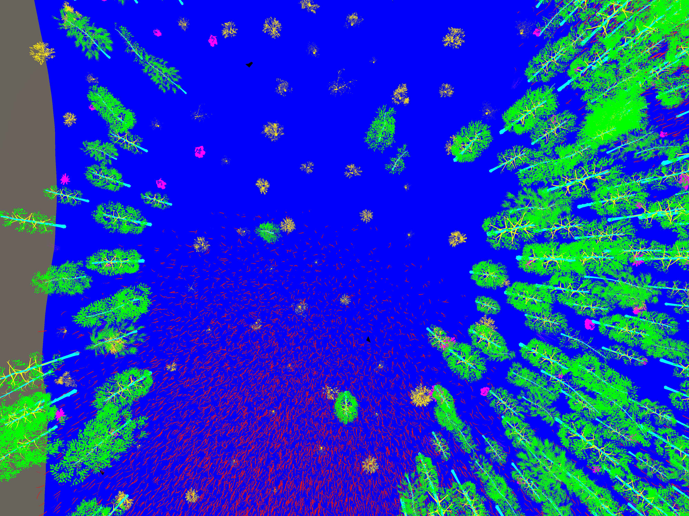

# Forest Simulator
Forest Simulator based on Unity

The present simulator aims to generate forest scenes procedurally, using a general seed to ensure its repeatability. The Simulator works in Editor Mode. 
Built and tested in Unity Editor version 2022.3.20f1.

## How to use:

The following guide is a step-by-step basic tutorial. Feel free to explore the functionalities and adapt them to your needs. 

 1. In a new scene or in a preexisting one, create an empty object in the Hierarchy (right click, create empty object). We will name this object as Terraformer in this tutorial, but you can change it freely. Make sure in the Inspector that its transformation is in (x, y, z) = (0, 0, 0). 
 2. Add the script "Terraform/Terraformer.cs" to the Terraformer object. After this, clicking in the Terraformer object will show in the a lot of customizable options. 
    1. Under "General", in "General Seed" set the seed number you want to generate. Every seed generates a different forest scene. Set True to "Use General Seed" and set "Size" to 256.
    2. Under "Terrain", set "Terrain Data" to a terrain asset under folder Data. For example, add "Data/Standard Pipelines/Terrain.asset". This will make it possible to edit the terrain properties. Click "Generate Terrain" to generate an object of the terrain. You will see it appear both in the Hierarchy and in the Scene window.
    3. Under "Pipelines", add the tree, bushes or other vegetation pipelines. For example, add "Data/Standard Pipelines/Trees.asset" and "Data/Standard Pipelines/Bushes.asset". Click "Run pipelines" to generate the objects associated with those pipelines (trees and bushes in the example).
    4. Under "Grass", set "Window Sampler Parallel" with a window sampler parallel object. or example, add the "Data/Standard Pipelines/WindowSampleParallel.asset". This will allow you to define the window and the maximum blades per window for the grass generation method. 
    5. Also under "Grass", set "Grass Data" with the grass configuration asset. For example, add the "Data/Standard Pipelines/GrassData.asset". This will allow you to configure the grass parameters for its generation. It requires to add the grass density pipeline to set its distribution. For example, add "Data/Standard Pipelines/GrassDensity.asset". Check "Draw Enabled" and "Auto Update" for the grass to be visible in Play Mode. Click "Generate grass" to generate the grass. As the generation is done in GPU, now it can only be shown in Play Mode, and not in Editor Mode.  
    6. Once you are satisfied with the scene, under "Exporter" check the elements you want to export. Set the number of terrain points you want to export. Click "Export" to export the point cloud of the scene. It will generate a .csv file with a random name. 
3. The pipelines of the trees, bushes, grass and the other objects in the Data folder can be copied and edited, so feel free to adjust them to your needs. You can edit the pipelines (like "Data/Standard Pipelines/Trees.asset" or Data/Standard Pipelines/GrassDensity.asset) by double-clicking the object and editing the graph. It allows to select which prefabs to import with that pipeline, and how the density and instantiation of the objects is done. 
4. In the script "Scripts/Terraform/Exporter.cs" you can edit the categories you want to export, and its associated classification. More categories can be added, by changing the tags of the respective objects. By default, it exports the following categories:
   1. Terrain: 0
   2. Trunk: 1
   3. Canopy: 2
   4. Branches: 3
   5. Bushes: 4
   6. Understorey: 5
   7. Grass: 6
   8. Cactae: 7
   9. Deadwood: 8

### How to use the survey simulator

The following guide is a step-by-step basic tutorial. Feel free to explore the functionalities and adapt them to your needs. Make sure that in the script "Flight/Output/ImageCapture/Geotagging/Geotagger.cs", in the line 32 the file name and location of the exiftool.exe file is well set. Modify it if it is changed, or if another version is used (for example, the linux version of the executable). 

1. Add the script "Flight/DroneControl.cs" to the camera object. 
2. In the inspector, with the camera selected and under the DroneControl configuration, drag the "Custom Terrain" object from the hierarchy to the Survey Area Configuration -> Object of Interest. Set "Enable Segmentation" if you want to export categorized images with color-code.
3. Add some GCP prefabs to the terrain manually. A pipeline can be used to add them automatically when generating the scene (Data/Standard Pipelines/GCPs.asset can be used as an example).
4. Enter Play mode. 

 

## Reference
This dataset was published in the paper:
Raverta Capua F., Schandin J., De Cristóforis, P.: Training point-based deep learning networks for forest segmentation with synthetic data. Presented to the ICPR 2024, publicly available in arxiv. 